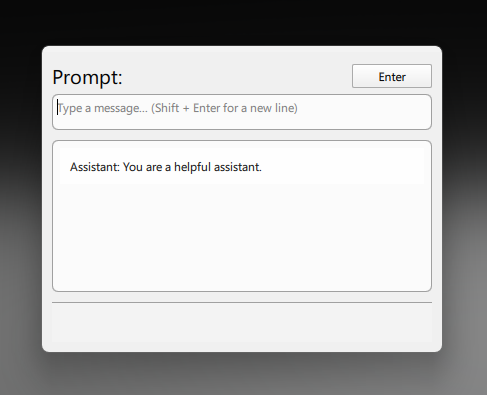
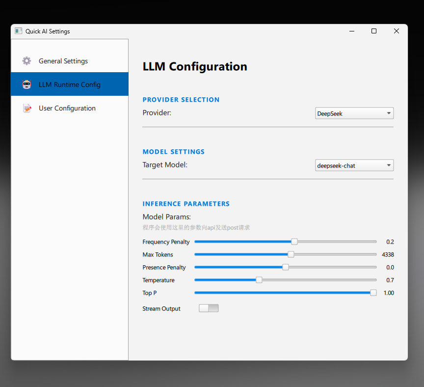

# Quick-AI-Assistant

一款支持多模型切换的智能对话助手，提供 CLI 和 Qt Quick GUI 两种交互方式。基于 C++17 和 Qt 6 构建，采用 DeepSeek API 实现流式和非流式对话。

---

## 项目简介

Quick-AI-Assistant 是一个轻量级、跨平台的 AI 对话客户端，支持以下特性：

- **多模型支持**：支持 DeepSeek 及其他 OpenAI 兼容的 API 提供商
- **流式对话**：实时显示 AI 回复内容
- **对话管理**：支持多会话管理和历史记录
- **配置灵活**：通过环境变量或 GUI 设置 API 密钥和参数
- **跨平台**：支持 Windows 和 Linux

---

## 界面演示

### 聊天界面


### 设置界面


---

## 使用方法

### cli tool 
- 需要将api key配置到env


```bash
# Windows PowerShell
$env:DEEPSEEK_API_KEY="your-api-key-here"
```

### quick-ai app
- 第一次运行时需要在设置页面配置provider
- chat窗口由快捷键ctrl+alt+enter启动


---

## 编译

### 环境

- **C++ Standard**: C++17
- **Qt Version**: Qt 6.8+
- **Build System**: CMake 3.23+
- **Generator**: Ninja (推荐)

### 使用 CMakePresets.json（推荐）

本项目提供了 `CMakePresets.json` 配置文件，支持一键配置和构建：

#### Windows

```bash
# 配置 Debug 版本
cmake --preset=windows-debug

# 构建
cmake --build build/windows-debug

# 配置 Release 版本
cmake --preset=windows-release
cmake --build build/windows-release
```

#### Linux


### 编译选项

| 选项 | 说明 | 默认值 |
| :--- | :--- | :--- |
| `QA_BUILD_UI` | 构建 Qt Quick GUI | ON |
| `QA_BUILD_TESTS` | 构建测试 | OFF |
| `CMAKE_BUILD_TYPE` | 构建类型 (Debug/Release) | Release |

---

## Development Guidelines

请阅读 [Development Guidelines](docs/dev_guide.md)

---

## TODO

- [x] LLM (DeepSeek) client CLI
- [x] Conversation management
- [x] Multi-model switching capability
- [x] Documentation
- [x] GUI based on Qt Quick
  - [x] UI - Session (聊天界面)
  - [x] UI - Settings (设置界面)
  - [x] User Configuration (用户配置)
  - [ ] Style switch ()
- [ ] Application icon
- [ ] Const String
---
