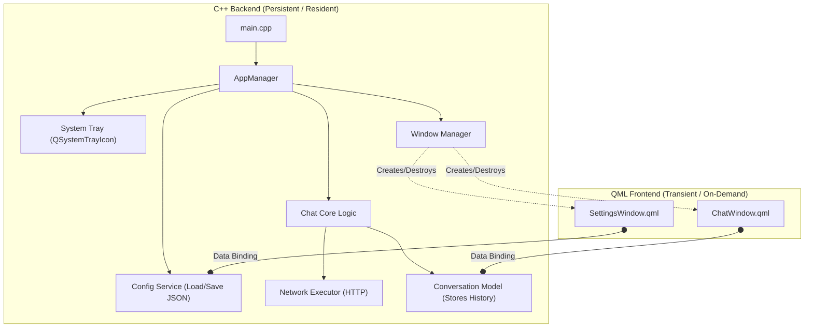

## Global
- chat(POST)
- info(GET)

## 一次调用
一次请求需要的参数是程序维护的主体，而不是再维护一个client对象

- model (deepseek-chat...etc combobox选择，维护一个列表，它是存放在) 调用的是哪个model，用于查找chapter
- api_key (用户输入)
- chapter
  - base_url
  - endpointer_url (chat/usr balance)
 
## 暂时实现deepseek和qwen两家厂商model的部分功能（chat/user balance）

- 配置文件应该维护的内容
  - 不同模型的api key，用户选择是否记住
  - 上一次选择的配置，上一次关闭前使用的是哪个model，下一次初始化就先预备(初始化到ui)哪个model
  - model列表，用于初始化combo box内容，并且设置初始值

## 示例
init.json，这里的方案和上面一次调用中计划的不一样，我突然想到这样设计，让程序更有可扩展性，而不是把一部分配置写死到代码中，而且可以设计一个额外配置生成的api,允许用户通过事先设定的引导程序从gui添加这些配置，比如用户可能需要使用gemini,依然可以使用本程序

```json
{
  "LLMs": [
    {
      "id": "DeepSeek",
      "baseUrl": "https://api.deepseek.com",
      "standard": "openai",
      "savedKey": true,
      "key": "xxxx",
      "functions": [
        {
          "request": "POST",
          "name": "deepseek-chat",
          "endPointer": "/chat/completions"
        },
        {
          "request": "GET",
          "name": "deepseek-user-balance",
          "endPointer": "/user/balance"
        },
        {
          "request": "GET",
          "name": "deepseek-list-models",
          "endPointer": "/models"
        }
      ]
    },
    {
      "id": "Qwen",
      "baseUrl": "https://dashscope.aliyuncs.com",
      "standard": "openai",
      "saveKey": true,
      "key": "xxxx",
      "functions": [
        {
          "request": "POST",
          "name": "qwen-plus",
          "endPointer": "/compatible-mode/v1/chat/completions"
        },
        {
          "request": "POST",
          "name": "qwen3-max",
          "endPointer": "/compatible-mode/v1/chat/completions"
        }
      ]
    }
  ],
  "default": {
    "name": "Qwen",
    "function": "qwen-plus"
  }
}
```
## 你（大语言模型）的任务
帮我分析这段开发设计文档中两种方案的合理性，一种是将和模型有关的部分写在代码中，另一种是以配置文件内容的形式存储，代码设计为任务执行的方式，而不再是某个具体的模型，如果有不遵循openai标准的我之前的架构也可以很方便的扩展，如果合适你需要帮我指定详细的开发计划，并给出适当的代码示例，我再结合实际加以调整


## plan

init.json
```json
{
  "providers": [
    {
      "id": "DeepSeek",
      "name": "DeepSeek",
      "baseUrl": "https://api.deepseek.com",
      "apiKey": "sk-xxxx", 
      "standard": "openai", 
      "models": [
        {
          "name": "deepseek-chat",
          "displayName": "DeepSeek Chat (V3)",
          "endpoint": "/chat/completions",
          "contextWindow": 32000
        },
        {
          "name": "deepseek-reasoner",
          "displayName": "DeepSeek R1 (推理)",
          "endpoint": "/chat/completions",
          "isReasoning": true
        }
      ],
      "otherEndpoints": {
          "balance": { "url": "/user/balance", "method": "GET" }
      }
    },
    {
      "id": "Qwen",
      "baseUrl": "https://dashscope.aliyuncs.com/compatible-mode/v1",
      "apiKey": "sk-xxxx",
      "standard": "openai",
      "models": [
        {
          "name": "qwen-plus",
          "displayName": "通义千问 Plus",
          "endpoint": "/chat/completions"
        }
      ]
    }
  ],
  "activeConfig": {
    "providerId": "DeepSeek",
    "modelName": "deepseek-chat"
  }
}
```


## Init

### 启动
- config 对象 (file read from init.json)
- system tray (持久存在)

### api


### ui设计

- gui
  - settings 界面
    - 启动依赖
      - 用户配置
    - 唤起方式 
      - 托盘action点击
    - 关闭方式
      - 点击关闭按钮
      - 操作系统的通用快捷键
    - 关闭后是否销毁：销毁
  - chat 界面
    - 启动依赖
    - 唤起方式
      - 托盘action点击
      - 自定义全局快捷键
    - 关闭方式
      - 失去焦点
      - 按下esc
    - 关闭后是否销毁：销毁


### 程序主体

- config 对象
  - 从init.json加载
  - 维护一个状态，完整描述用户需要进行某个模型的chat的post请求的全部参数
  - 用户可以通过gui修改这个状态
  - 用户可以通过gui修改配置文件init.json
- system tray
  - 低消耗地运行在后台，用户需要使用应用则可以快速启动，而不必重新运行可执行文件
  - 提供启动设置窗口，chat窗口的action
- chat conversation 对象
  - 当用户创建了一个chat，则将内容存入该对象
  - gui显示的内容依赖该对象
  - context的维护也依赖该对象
- gui
  - chat
    - 由用户指令创建，在用户启动时才创建，不使用则销毁
    - 创建时应从chat conversation抓取内容
  - settings
    - 由用户指令创建，独立的一个窗口，使用时创建，不使用销毁

