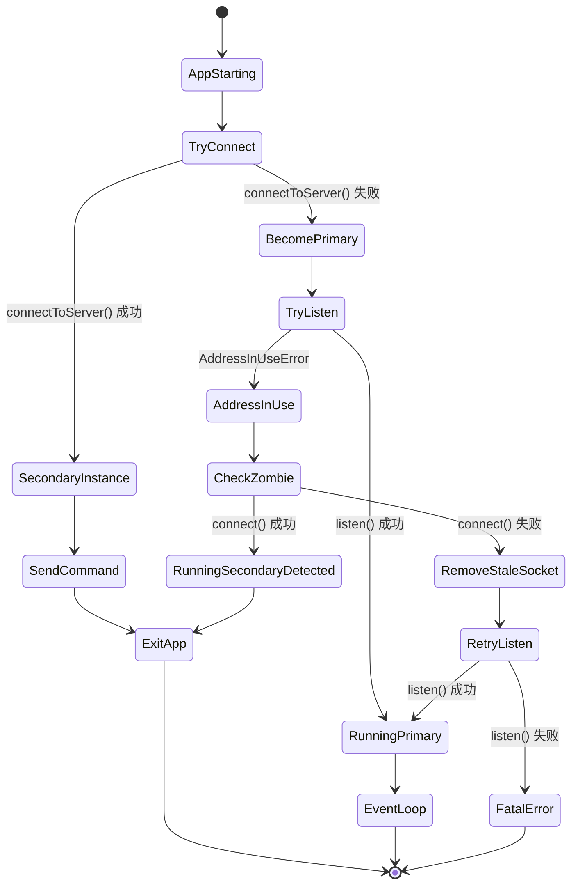

## IPC单例模式的运行过程
第一次启动时会尝试连接，如果未存在实例当前应用会成为主实例，如果已存在实例则执行socket参数对应的操作并退出次实例

```mermaid
stateDiagram-v2

    [*] --> AppStarting

    AppStarting --> TryConnect

    TryConnect --> SecondaryInstance : connectToServer() 成功
    TryConnect --> BecomePrimary : connectToServer() 失败

    SecondaryInstance --> SendCommand
    SendCommand --> ExitApp
    ExitApp --> [*]

    BecomePrimary --> TryListen

    TryListen --> RunningPrimary : listen() 成功
    TryListen --> AddressInUse : AddressInUseError

    AddressInUse --> CheckZombie

    CheckZombie --> RunningSecondaryDetected : connect() 成功
    CheckZombie --> RemoveStaleSocket : connect() 失败

    RunningSecondaryDetected --> ExitApp

    RemoveStaleSocket --> RetryListen

    RetryListen --> RunningPrimary : listen() 成功
    RetryListen --> FatalError : listen() 失败

    RunningPrimary --> EventLoop
    EventLoop --> [*]

    FatalError --> [*]
```