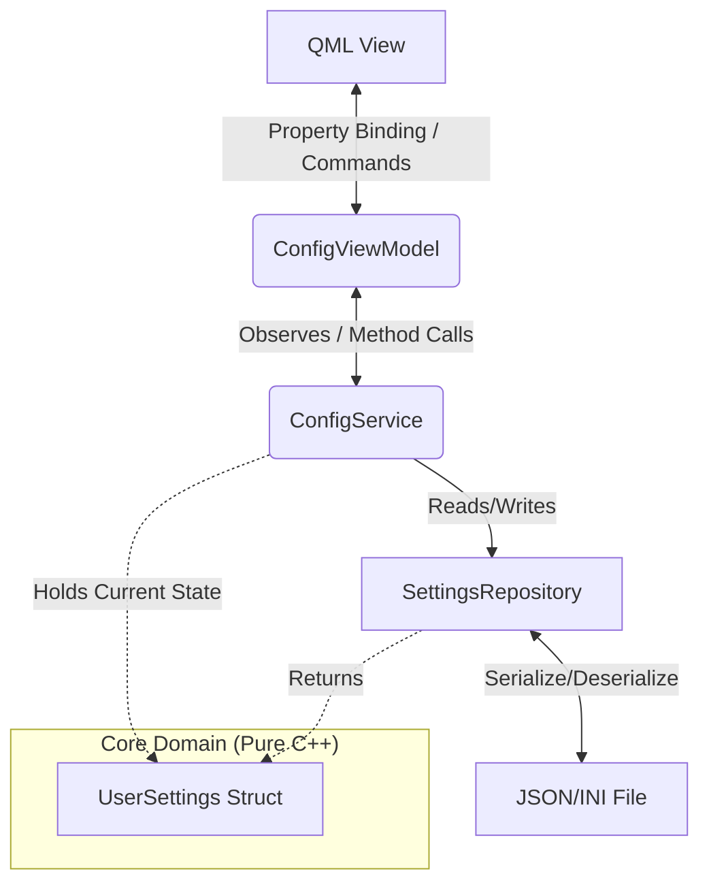
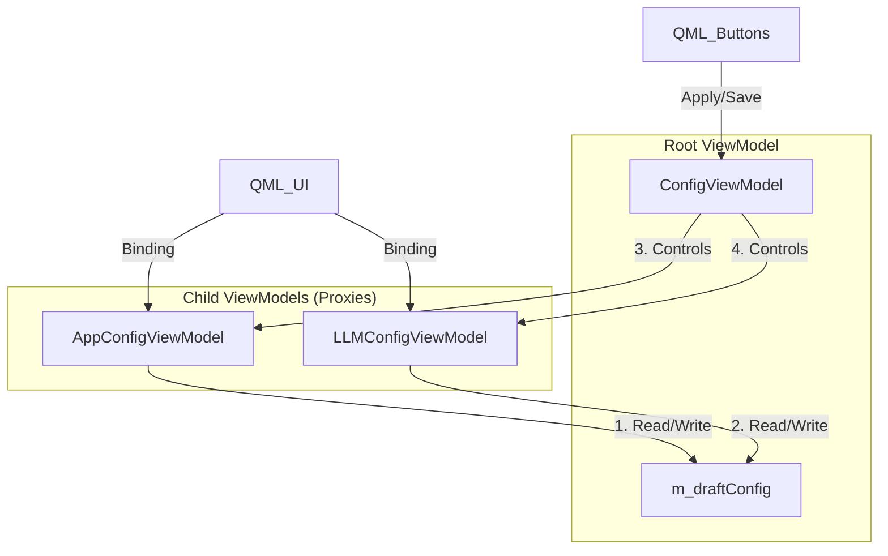
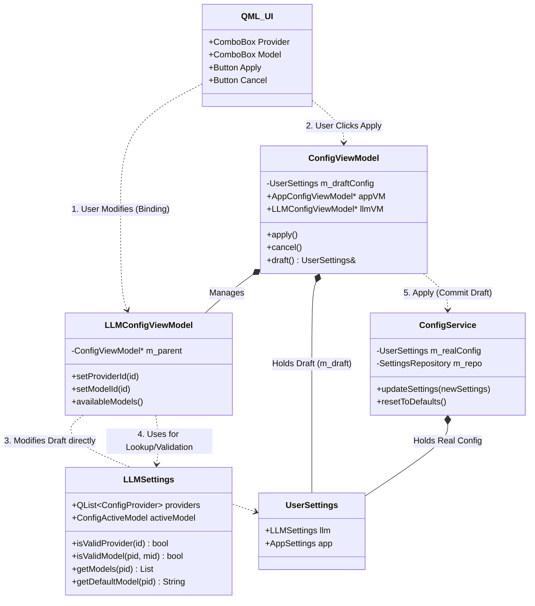

## 我的代码架构如下

- ConfigService: 持有一个UserSettings对象，负责具体执行来自ui的指令，并提供ui需要的数据
- ConfigViewModel: 和qml绑定的c++对象，直接和qml交互，同时和ConfigService通过信号槽交互，把ui的请求发到Service
- UserSettings: 只负责用户配置的io操作，提供读写配置文件的接口
- QML ui: qml编写的ui界面，只负责传递用户的请求和渲染后端数据

## mvvm现代软件工程架构学习

你是一个专业10年c++,qt,qml软件架构师，我希望学习现代化的mvvm架构来处理这个gui应用程序，你帮我的架构给出优化建议，让我的代码的可维护性和可读性更好，更有利于未来维护和添加新功能


## 改进







对于我的应用我决定针对当前混乱架构导致开发停滞作出一些修改，新增加一个概念，页面，每个页面单独管理自己的配置，并且涉及字符串的一些配置使用哈希表进行管理

- 配置应用：修改即应用
- 配置保存：修改即写入 vs 关闭前写入，写入工作放入额外线程完成
- 配置
## File I/O Tools
- JsonConfigFile
  - 实现从配置文件读取Json对象(I/O)
  - 实现将Json对象写入配置文件(I/O)

## AppConfig页面

- AppViewModel

- AppSettings 元数据 struct
  - Appearance
  - LLM默认参数，用于启动读取

- AppService
  - 包含一个AppSettings对象
  - 实现从Json对象读取App相关配置的函数(使用JsonConfigFile)
  - 实现将App相关配置写入配置文件的函数(使用JsonConfigFile)

## LLMConfig页面
- LLMConfigViewModel
- LLMSettings 元数据
  - LLM运行时参数，从AppSettings初始化
- LLMService
  - 包含一个LLMSettings对象
  - 实现getLLMParams，为post请求提供参数
  - 实现setLLMParams，实现ui修改运行参数的请求


# 需求：数据结构设计
你是一位专业的qml和c++现代开发者，架构师，拥有10年大企业工作经验和丰富开源社区维护经验，站在现代gui应用开发的基础上帮我设计一下这个json配置需要使用的数据结构
- json解析之后应该如何存储在内存中
- 应用运行中使用的llm post结构体

## 预想的配置文件内容
```json
{
  "Appearance": {
    "theme": "Light"
  },
  "RuntimeParams": {
    "max_tokens": 4096,
    "temperature": 0
  },
  "LLMSelection": {
    "Providers": [
      {
        "name": "DeepSeek",
        "protocol": "OpenAI",
        "baseUrl": "https://api.deepseek.com",
        "apiKey": "",
        "baseEndPointer": "/chat/completions",
        "models": [
          {
            "name": "deepseek-chat",
            "capabilities": ["text"]
          },
          {
            "name": "deepseek-reasoner",
            "capabilities": ["text"]
          }
        ]
      },
      {
        "name": "Qwen",
        "protocol": "OpenAI",
        "baseUrl": "https://dashscope.aliyuncs.com",
        "apiKey": "",
        "baseEndPointer": "/compatible-mode/v1/chat/completions",
        "models": [
          {
            "name": "qwen3-max",
            "capabilities": ["text"]
          }
        ]
      }
    ],
    "LaunchSelection": {
      "providerId": "DeepSeek",
      "model": "deepseek-chat"
    }
  }
}
```

## 设置页面的结构

### Appearance 页面
#### theme
- value: [light,dark,system]
- ui行为: combobox选择->调用修改主题的代码->刷新页面渲染

### LLM Init 页面
#### 启动时加载的运行时参数
- value: 多个key-value组合
- ui行为：用户修改值，写入配置，不该动当前程序行为，因为这只会在下一次启动时工作
#### 启动时加载的默认选择的模型，需要读取时验证，保证值为provider列表中存在
- value: 2个key-value组合
- ui行为：用户修改值，写入配置，不该动当前程序行为，因为这只会在下一次启动时工作

### LLM selection 页面
该页面包含的是llm api post请求体需要的主要参数，每次请求都会以程序中存储的`post结构体`为内容，该页面的修改绑定到`post结构体`
#### provider选择combobox
- value: [DeepSeek, Qwen...]
- ui行为：combobox选择->触发provider更改->该provider下面的选择值改变为当前选择的provider包含的值
- 初始化：如果LLM init的值合法，则取该处值，否则使用第一个值
#### 确认provider之后的值选择区域
- value: 包含baseURL，protocol，apikey，models列表等多个值
- ui行为: 用户必须选择一个provider才可以继续编辑该区域，修改后触发修改`post结构体`
- 初始化：如果LLM init的值合法，则取该处值，否则使用默认值，其中model使用第一个值
#### LLM params
- value: 同`LLM init`部分一致，只是该部分修改会实时修改`post结构体`
- ui行为：用户修改值->触发修改`post结构体`
- 初始化：如果LLM init的值合法，则取该处值，否则使用默认构造值